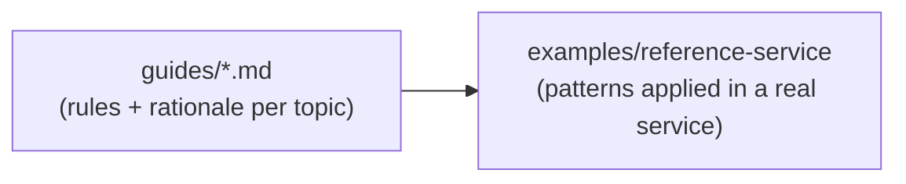
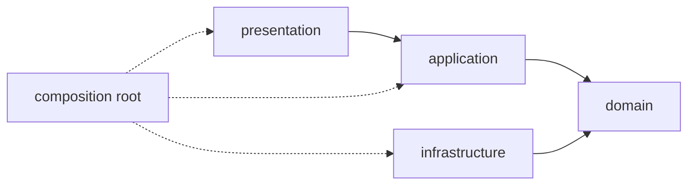

# FastAPI Canon

Opinionated conventions for building **maintainable, scalable** FastAPI services, distilled from patterns learned while building several production FastAPI applications.

This is a **work-in-progress** collection of opinions, not a complete framework. It deliberately leaves out everything agents already tend to get right on their own, and focuses instead on the recurring stumbling blocks I keep seeing built _without_ these patterns, the ones I believe hold up better _with_ them. The goal isn't full coverage, it's a shared understanding of where medium-to-large FastAPI projects tend to bottleneck:

- one **consistent structure** across projects
- **clear responsibilities** per layer
- **testability** by construction

It targets **medium to large** projects, where feature growth, team size, or lifetime make architectural discipline pay off. Small scripts and single-file APIs don't need this.

## Who this is for

- **Coding agents**, first and foremost. This repository exists so that when I start a new project, I can point an agent at it and say "build it this way." The guides are written to be loaded as agent context.
- **Me and other humans**, second. This README is the human-readable map of the same rules, useful when reviewing agent output, onboarding to a new project that follows these patterns, or deciding whether a rule still makes sense.

If you are an agent reading this to bootstrap a new project, start with [`guides/architecture.md`](guides/architecture.md) and follow the links from there into the layer-specific guides.

## Structure

The repository has two parts:

| Part                                                        | Purpose                                                                        |
| ----------------------------------------------------------- | ------------------------------------------------------------------------------ |
| [`guides/`](guides)                                         | One topic per file: the rules for that area, with rationale and code samples.  |
| [`examples/reference-service/`](examples/reference-service) | A small real FastAPI service (task API) implementing every pattern end to end. |



Read a guide for the rules and the _why_, and the reference service for _how it looks in real code_.

Guides are kept intentionally short and normative rather than exhaustive, so they stay cheap to load as agent context.

## Core idea: feature slices with inward dependencies

Business code is organized by **feature**, not by technical layer. Within a feature, code is split into `domain`, `application`, `infrastructure`, and `presentation`, but only once a layer has real behavior worth separating.

```text
src/api/
├── features/
│   └── tasks/
│       ├── domain/          # entities, value objects, repository ports
│       ├── application/     # use cases, orchestration
│       ├── infrastructure/  # SQL repositories, external clients
│       ├── presentation/    # FastAPI routers, schemas, mappers
│       └── feature.py       # the feature's public descriptor
├── infrastructure/          # shared, cross-feature mechanisms
├── presentation/
└── main.py
```

Dependencies only ever point inward, toward the domain:



The domain owns its ports (e.g. `TaskRepository` as an `ABC`); infrastructure implements them; application depends on the port, never the adapter. The domain itself must not import FastAPI, Pydantic, Dishka, SQLAlchemy, or SQLModel; see [Architecture](guides/architecture.md).

## Where to jump

- **Starting a new project or feature?** Read [Architecture](guides/architecture.md) first.
- **Modeling business rules?** [Domain](guides/domain.md) and [Application](guides/application.md).
- **Wiring dependencies?** [Dependency Injection](guides/dependency_injection.md): Dishka providers for non-HTTP dependencies, FastAPI `Depends` only for HTTP concerns.
- **Database work?** [Database](guides/database.md) for sessions/repositories, [Migrations](guides/migrations.md) for Alembic layout.
- **HTTP layer?** [Presentation](guides/presentation.md) for routers, schemas, and mapping.
- **Login, sessions, OAuth?** [Authentication](guides/authentication.md).
- **Package boundaries?** [Imports and Re-exports](guides/imports-and-reexports.md).
- **Repo/tooling layout?** [uv workspace](guides/uv-workspace.md), [Docker](guides/docker.md), [Infrastructure](guides/infrastructure.md).
- **Want to see it all in one working service?** [`examples/reference-service/`](examples/reference-service), a task API implementing every pattern end to end.

The reference service itself is intentionally too small to justify this much structure on its own; a single-feature task API doesn't need four layers. It exists purely to demonstrate the pattern in a runnable, end-to-end shape, not to argue that this project's size warrants it.

## Core technologies

These guides are built around three technologies: **FastAPI**, **Pydantic**, and **Dishka**.

Dishka is the centerpiece. It is a dependency-injection container that keeps FastAPI's `Depends` mechanism confined to HTTP concerns (auth, headers, cookies) and lets application services, repositories, and domain ports be wired through constructor injection instead. That single boundary, no FastAPI dependency ever leaking into the application layer, resolved most of the recurring problems this repository was written to solve: services that were untestable without spinning up a FastAPI app, use cases entangled with `Request`/`HTTPException`, and DI wiring scattered across router files. See [Dependency Injection](guides/dependency_injection.md).

## Status

This is a living document, actively revised as new projects surface new patterns or contradict old ones.
