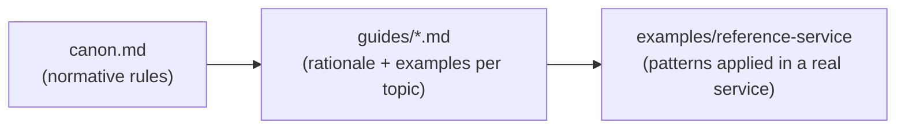
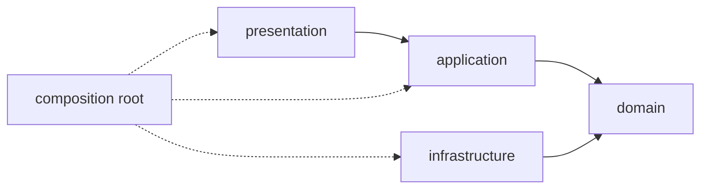

# FastAPI Canon

Opinionated conventions for building maintainable, scalable FastAPI services — distilled from patterns learned while building several production FastAPI applications.

This is a **work-in-progress** collection of opinions, not a framework or a template you copy verbatim. It targets **medium to large** projects, where feature growth, team size, or lifetime make architectural discipline pay off. Small scripts and single-file APIs don't need this.

## Who this is for

- **Coding agents**, first and foremost. This repository exists so that when I start a new project, I can point an agent at it and say "build it this way." `canon.md` is written to be loaded as agent context.
- **Me and other humans**, second. This README is the human-readable map of the same rules — useful when reviewing agent output, onboarding to a new project that follows the canon, or deciding whether a rule still makes sense.

If you are an agent reading this to bootstrap a new project, jump straight to [`canon.md`](canon.md) — it is the complete normative reference in compact form. Everything else here exists to explain and justify it.

## Structure

The repository has three parts:

| Part | Purpose |
|---|---|
| [`canon.md`](canon.md) | The short, normative rule set. Dense, imperative, meant for agent context windows. |
| [`guides/`](guides) | One topic per file, expanding each area of the canon with rationale and code samples. |
| [`examples/reference-service/`](examples/reference-service) | A small real FastAPI service (task API) implementing every pattern end to end. |



Read `canon.md` for *what* to do, a guide for *why*, and the reference service for *how it looks in real code*.

## Core idea: feature slices with inward dependencies

Business code is organized by **feature**, not by technical layer. Within a feature, code is split into `domain`, `application`, `infrastructure`, and `presentation` — but only once a layer has real behavior worth separating.

```text
src/api/
├── features/
│   └── tasks/
│       ├── domain/          # entities, value objects, repository ports
│       ├── application/     # use cases, orchestration
│       ├── infrastructure/  # SQL repositories, external clients
│       ├── presentation/    # FastAPI routers, schemas, mappers
│       └── feature.py       # the feature's public descriptor
├── infrastructure/          # shared, cross-feature mechanisms
├── presentation/
└── main.py
```

Dependencies only ever point inward, toward the domain:



The domain owns its ports (e.g. `TaskRepository` as an `ABC`); infrastructure implements them; application depends on the port, never the adapter. The domain itself must not import FastAPI, Pydantic, Dishka, SQLAlchemy, or SQLModel — see [Architecture](guides/architecture.md).

## Where to jump

- **Starting a new project or feature?** Read [`canon.md`](canon.md) top to bottom, then [Architecture](guides/architecture.md).
- **Modeling business rules?** [Domain](guides/domain.md) and [Application](guides/application.md).
- **Wiring dependencies?** [Dependency Injection](guides/dependency_injection.md) — Dishka providers for non-HTTP dependencies, FastAPI `Depends` only for HTTP concerns.
- **Database work?** [Database](guides/database.md) for sessions/repositories, [Migrations](guides/migrations.md) for Alembic layout.
- **HTTP layer?** [Presentation](guides/presentation.md) for routers, schemas, and mapping.
- **Login, sessions, OAuth?** [Authentication](guides/authentication.md).
- **Package boundaries?** [Imports and Re-exports](guides/imports-and-reexports.md).
- **Repo/tooling layout?** [uv workspace](guides/uv-workspace.md), [Docker](guides/docker.md), [Infrastructure](guides/infrastructure.md).
- **Want to see it all in one working service?** [`examples/reference-service/`](examples/reference-service) — a task API you can run locally (`uv sync --all-groups && uv run python create_schema.py && uv run uvicorn app.main:app --reload`).

## Status

This is a living document, actively revised as new projects surface new patterns or contradict old ones. Guides may lag behind `canon.md` briefly after a rule changes; `canon.md` is the source of truth if the two disagree.
